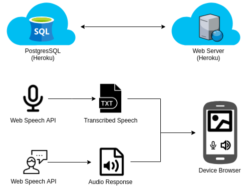
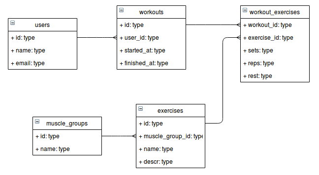
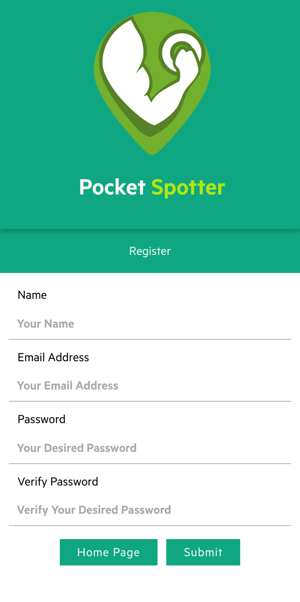
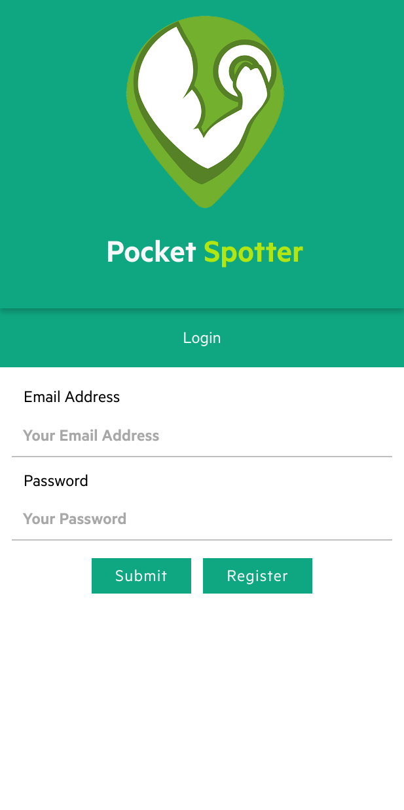
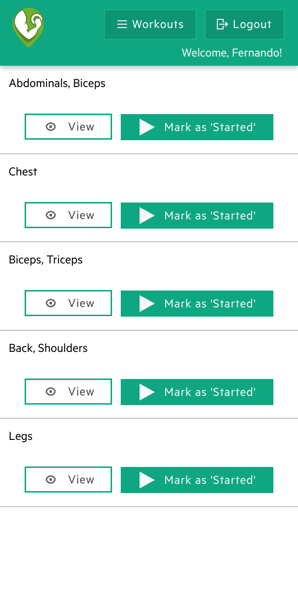
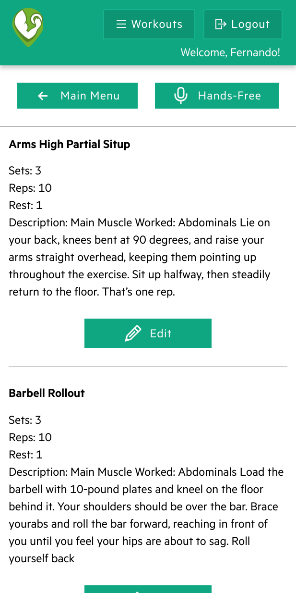
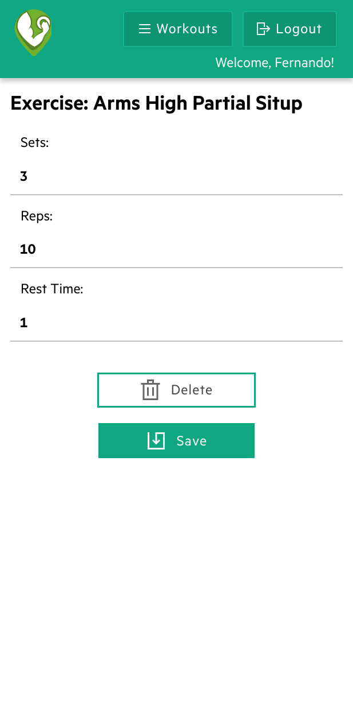

# Pocket Spotter

## About

Workout App

## User's workouts

## Workout's exercises

## Client

  Client's [readme](/client) has the following information:
  - Getting Started
  - Dependencies

## Server

  Server's [readme](/server) has the following information:
  - Getting Started
  - Dependencies
  - Routes

## Network Diagram

## ERD

## Upcoming Features

1. Profile page
2. Create custom exercises
3. Create new workout routines
4. Workout history page
5. Instructions page
6. Share workout
7. View someone else's workout
8. Like and comment on someone else's workout
9. Display workout schedule (calendar)

## Screenshots

## Known Issues
